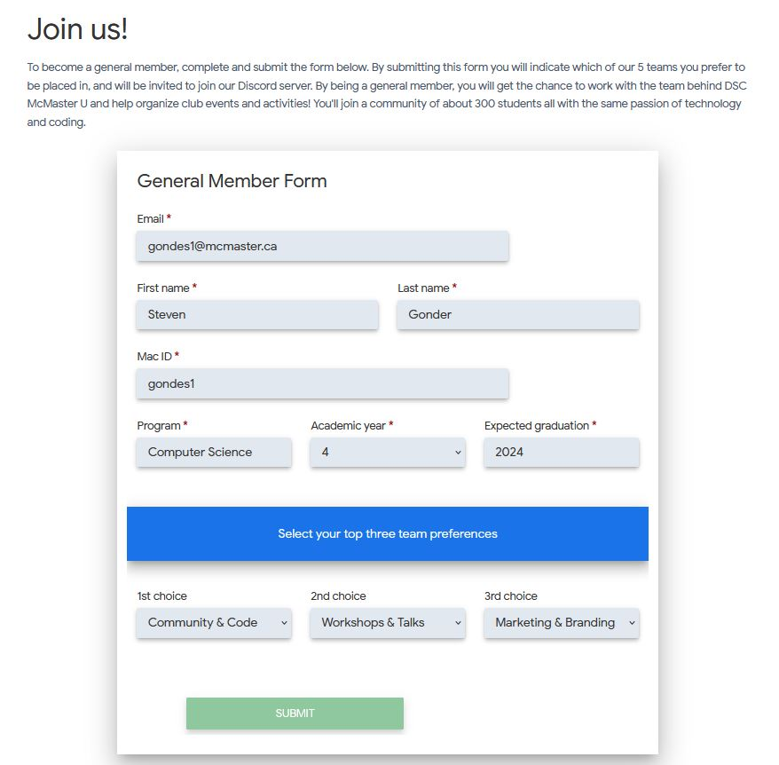
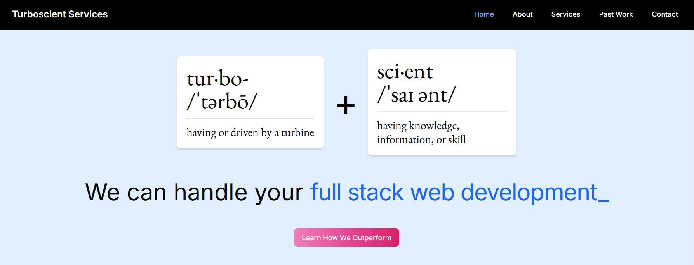
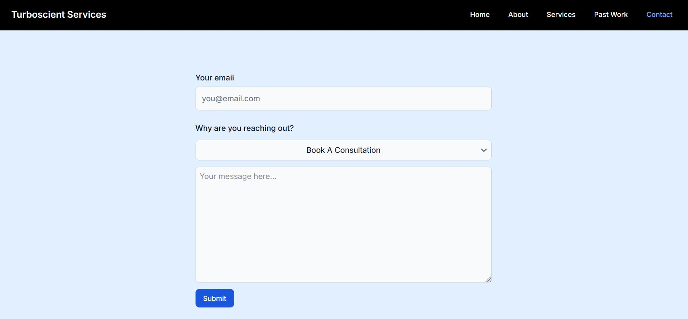
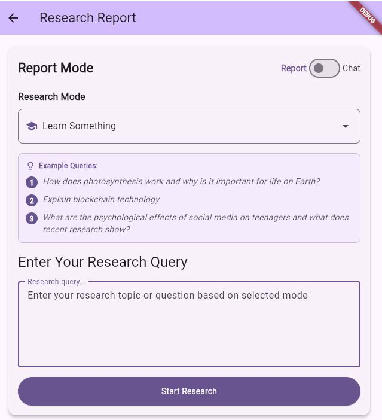
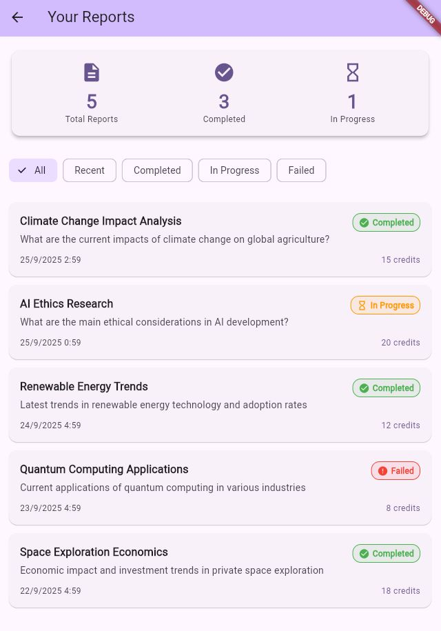
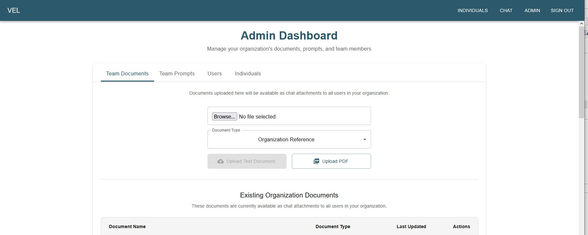
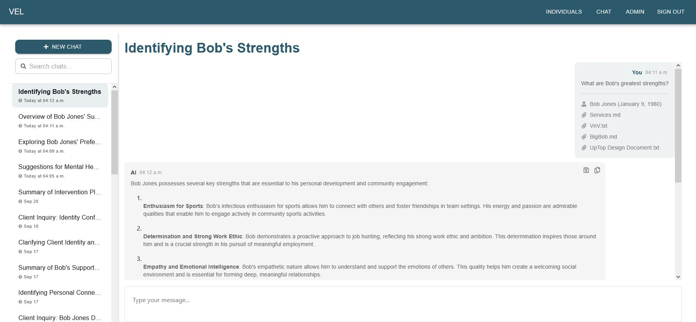
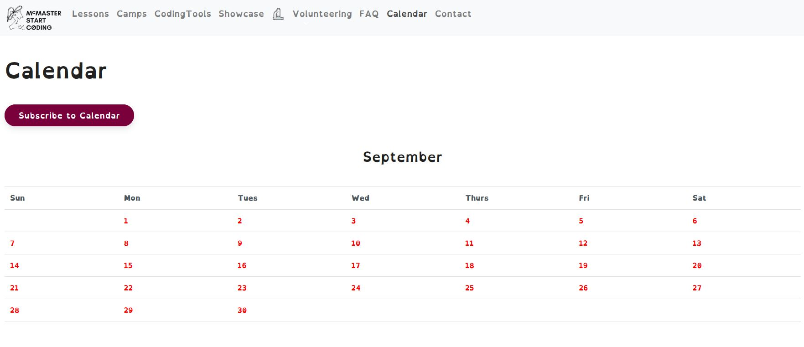
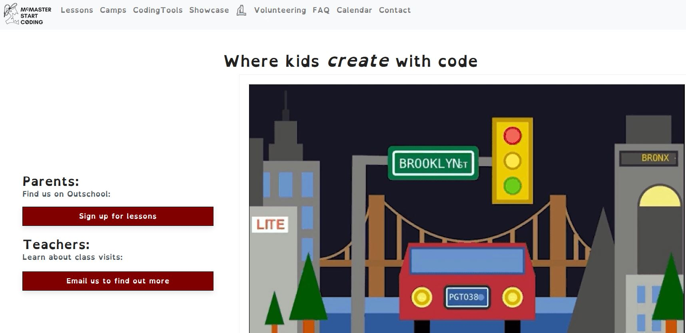

# web-portfolio
Some of the frontend work I've done or collaborated lightly with others on. A few of these, notably the Flutter mobile UIs, are works in progress. Interfaces range from functional/minimal to modern/stylistic. 

Languages: React.js, Flutter, Elm

